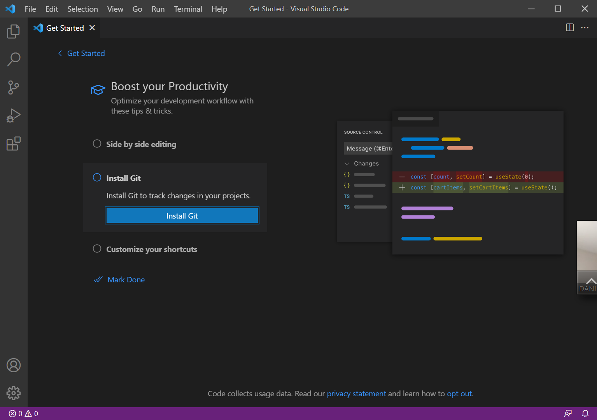
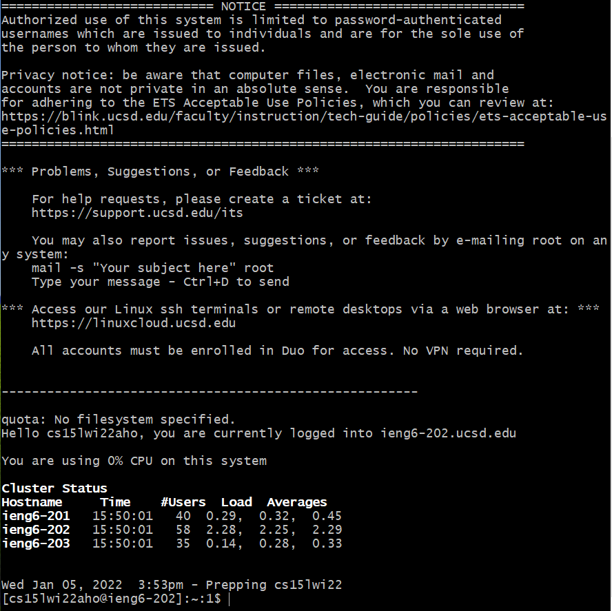
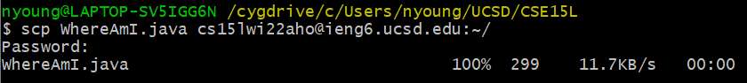
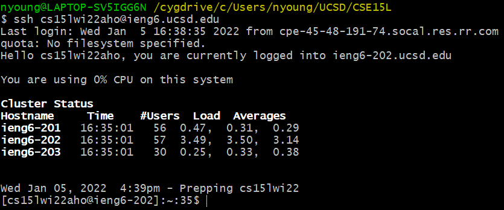

# Lab Report 1 Week 2

[Report Guidelines](https://ucsd-cse15l-w22.github.io/week/week2/#week-2-lab-report)

## 1. Installing VSCode
Go to the [VSCode download page](https://code.visualstudio.com/download), then download and run the program installer for your operating system. Once the program is installed, it should look like the following upon startup:

## 2. Remotely Connecting

## 3. Trying Some Commands

## 4. Moving Files with `scp`

## 5. Setting an SSH Key

## 6. Optimizing Remote Running

