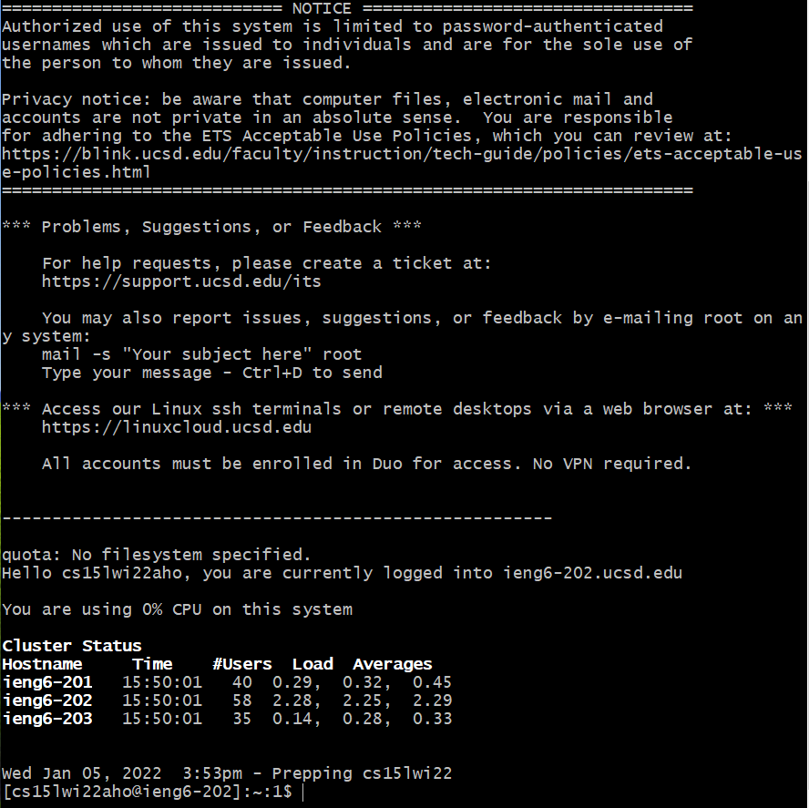
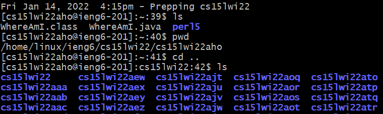
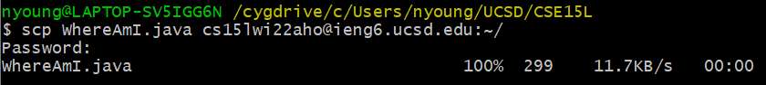
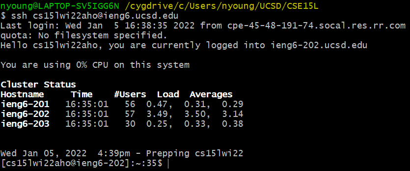
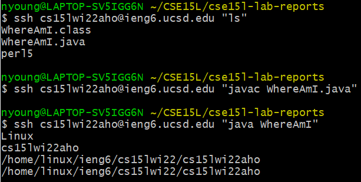

# Lab Report 1 Week 2

[Lab 1: Remote Access and the Filesystem](https://ucsd-cse15l-w22.github.io/week/week1/)

[Report Guidelines](https://ucsd-cse15l-w22.github.io/week/week2/#week-2-lab-report)

## 1. Installing VSCode
Go to the [VSCode download page](https://code.visualstudio.com/download), then download and run the program installer for your operating system. Once the program is installed, it should look like the following upon startup:


## 2. Remotely Connecting
Install [OpenSSH](https://docs.microsoft.com/en-us/windows-server/administration/openssh/openssh_install_firstuse), then look up your course-specific account at the [UCSD account lookup page](https://sdacs.ucsd.edu/~icc/index.php). All accounts for this course will begin with `cs15lwi22` followed by three letters; mine are `aho`. Using a terminal of your preference, input the command `$ ssh cs15lwi22aho@ieng6.ucsd.edu` with the three letters of your account replacing those of mine. Upon successfully connecting, the following should be displayed:



## 3. Trying Some Commands
Next, try some commands like the following to ensure that things are working correctly. I just used some basic commands to list the files in the current directory, display the directory path, go up one directory, and list the files in that directory:



The `exit` command or CTRL+D can be used to log out of the remote server from the terminal.

## 4. Moving Files with `scp`
To move files with the secure copy command `scp`, write the command, the filename, and the destination folder like in the image below. Input your SSH password when prompted and the filename will appear on the next line if successful.



## 5. Setting an SSH Key
Completing the previous step multiple times while working on a programming assignment may hinder workflow, so it is essential to set an SSH key. To do so, input the command `$ ssh-keygen`. There will be a prompt to enter and confirm a passphrase, but for the purpose of a lower-division CS course, there isn't really a need to set one.

Then, the public key needs to be added to the `.ssh` directory of your course-specific account on the server:
```
$ ssh cs15lwi22aho@ieng6.ucsd.edu
$ Password:
$ mkdir .ssh
$ exit
$ scp /Users/nyoung/.ssh/id_rsa.pub cs15lwi22aho@ieng6.ucsd.edu:~/.ssh/authorized_keys
```

If successful, it should be possible to `ssh` or `scp` from the client to the server without needing to enter a password:



## 6. Optimizing Remote Running
There are some shortcuts that can be used to make running commands on the remote service more efficient:

By surrounding a command in double quotes, logging into the remote server and running the command can be done in just one line.

By using the `^` key, I didn't need to type in the `ssh cs15lwi22aho@ieng6.ucsd.edu` again. I replaced `ls` with `javac WhereAmI.java` to compile the file in the remote server.

Then, using the `^` key again, I replaced the compile command in the quotes with `java WhereAmI` to run the file.



It took six keystrokes for the first list files command. For the second command, it took the number of keystrokes to replace `ls` with the compile command. For the third and last command, it took the number of keystrokes to replace the `javac` command with `java`. Overall, it took less than thirty seconds to run the three commands.
