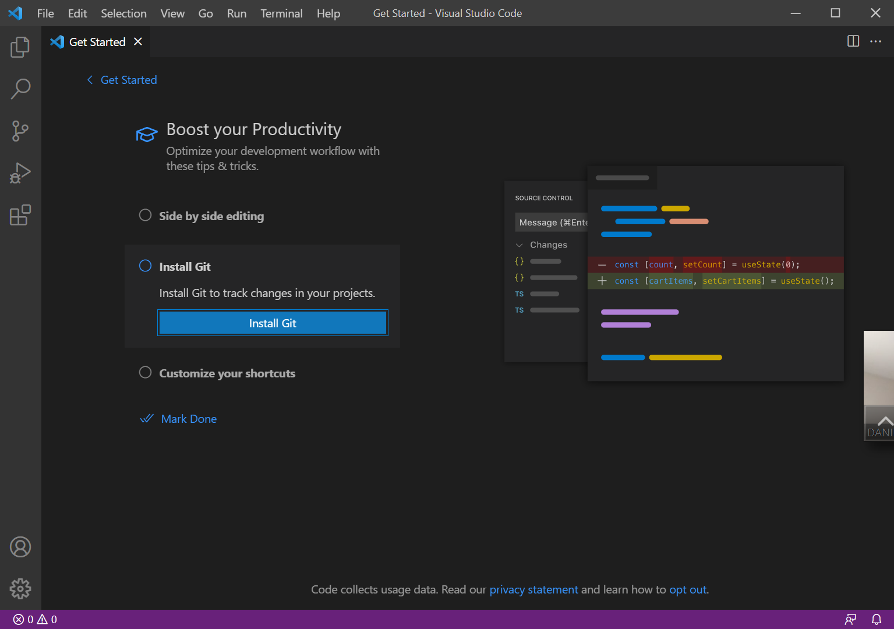

# Lab Report 2 Week 4

[Lab 3: Incremental Programming and Debugging](https://ucsd-cse15l-w22.github.io/week/week3/)

[Lab 4: When Tests Accumulate](https://ucsd-cse15l-w22.github.io/week/week4/)

[Report Guidelines](https://ucsd-cse15l-w22.github.io/week/week4/#week-4-lab-report)

## 1. Bug Fix 1 - Skipping lines and excluding links
In lab 3, we came across a bug where the program wouldn't be able to skip lines and included links that were not in proper format. As can be seen in the following images, we added code to fix these issues.

## 2. Bug Fix 2

## 2. Bug Fix 2

