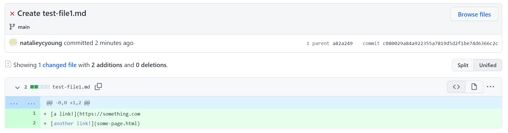

# Lab Report 2 Week 4

[Lab 3: Incremental Programming and Debugging](https://ucsd-cse15l-w22.github.io/week/week3/)

[Lab 4: When Tests Accumulate](https://ucsd-cse15l-w22.github.io/week/week4/)

[Report Guidelines](https://ucsd-cse15l-w22.github.io/week/week4/#week-4-lab-report)

## 1. Bug Fix 1 - Skipping lines and excluding links
In lab 3, we came across a bug where the program wouldn't be able to skip lines and included links that were not in proper format.

Code changes:

[test-file1.md](https://github.com/natalieycyoung/markdown-parse/blob/main/test-file1.md) was used as the input:

## 2. Bug Fix 2

## 2. Bug Fix 2

