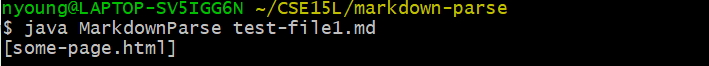

# Lab Report 2 Week 4

[Lab 3: Incremental Programming and Debugging](https://ucsd-cse15l-w22.github.io/week/week3/)

[Lab 4: When Tests Accumulate](https://ucsd-cse15l-w22.github.io/week/week4/)

[Report Guidelines](https://ucsd-cse15l-w22.github.io/week/week4/#week-4-lab-report)

## 1. [Code Change 1](https://github.com/natalieycyoung/markdown-parse/commit/e98aaff90a2c625a3085ec1f47441dc2638ea95d)
In lab 3, we came across a bug where the program wouldn't be able to skip lines and included links that were not in proper format.

**Failure-inducing output**  
[test-file1.md](https://github.com/natalieycyoung/markdown-parse/blob/main/test-file1.md) is the first _failure-inducing input_:

**Symptom**  

**Relationship between bug, symptom, and input**  
`test-file1.md` is the _failure-inducing input_ to `MarkdownParse.java`: due to a _bug_ in the body of the `while` loop (`toReturn.add(markdown.substring(openParen + 1, closeParen))`), it causes a _symptom_ in which the program prints the first line of the test file's contents despite it not containing a link.

**Code Change**  

**Output after fix**  

## 2. [Code Change 2](https://github.com/natalieycyoung/markdown-parse/commit/e98aaff90a2c625a3085ec1f47441dc2638ea95d)

**Failure-inducing input**  
The second _failure-inducing output_ is [test-file2.md](https://github.com/natalieycyoung/markdown-parse/blob/main/test-file2.md):

**Symptom**  
The _symptom_ in this case is the output `java.lang.StringIndexOutOfBoundsException: begin 0, end -1, length 14`.

**Bug**  
The _bug_ causing the symptom above can be found in the body of the `while` loop. `toReturn.add(markdown.substring(openParen + 1, closeParen))` attempts to assign the substring of the contents of `test-file2.md` between indices `-1 + 1` and `-1` to `toReturn`. Since the failure-inducing input does not contain any open or close parentheses, `openParen` and `closeParen` returns `-1` and the `IndexOutOfBoundsException` symptom is thrown.

**Code Change**

**Output after fix**  

## 3. [Code Change 3](https://github.com/natalieycyoung/markdown-parse/commit/e98aaff90a2c625a3085ec1f47441dc2638ea95d)

**Failure-inducing input**  
The third _failure-inducing input_ is [test-file3.md](https://github.com/natalieycyoung/markdown-parse/blob/main/test-file3.md).  

**Symptom**  
The _symptom_ in this case is the output `java.lang.OutOfMemoryError`

**Bug**  
The symptom suggests that there is something in the code that causes the program to exceed the Java heap space. The _bug_ can be found in the `while` loop: If there are no brackets in the input, then `currentIndex` is always `0` and therefore less than the length of the contents of `test-file3.md`. This makes the condition `currentIndex < markdown.length()` always true, leading to an infinite loop that exceeds the heap space and causes the `OutOfMemoryError` to be thrown.

**Code Change**  

**Output after fix**  

