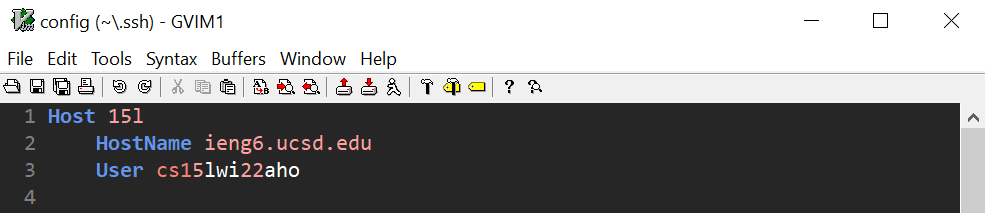
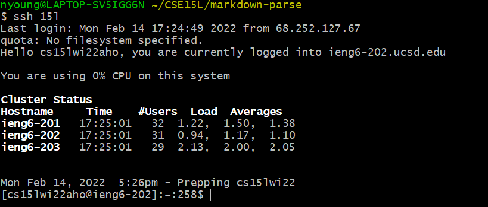

# Lab Report 3 Week 6

Date: 2022-02-11

[Lab 5: It Works on My Machine](https://ucsd-cse15l-w22.github.io/week/week5/)

[Lab 6: Build and Run Automation](https://ucsd-cse15l-w22.github.io/week/week6/)

[Report Guidelines](https://ucsd-cse15l-w22.github.io/week/week6/#week-6-lab-report)

## 1. Lab 5 Group Choice 1 - Streamlining `ssh` Configuration

When I log into `ieng6` from my personal device, I need to type in `ssh cs15lwi22aho@ieng6.ucsd.edu`, which is a lot to type and remember. To reduce the amount of typing needed, I created a config file `~/.ssh/config` and put in an entry that communicates the username to SSH when logging into specific servers and allows servers to be aliased.

Using vim, I added a few lines to my config file to specify the host nickname, host name, and my username.  


_If there are any issues, another line can be added to explicitly refer to the `id_rsa` file:_  
```
Host cs15l
	HostName ieng6.ucsd.edu
	User cs15lwi22aho
	IdentityFile ~/.ssh/id_rsa
```

I'm now able to `ssh` into `ieng6.ucsd.edu` with the host alias `15l`, using 24 keystrokes less `cs15lwi22aho@ieng6.ucsd.edu`:  


[Some more information on SSH configuration](https://linuxize.com/post/using-the-ssh-config-file/)
