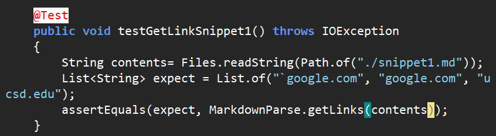
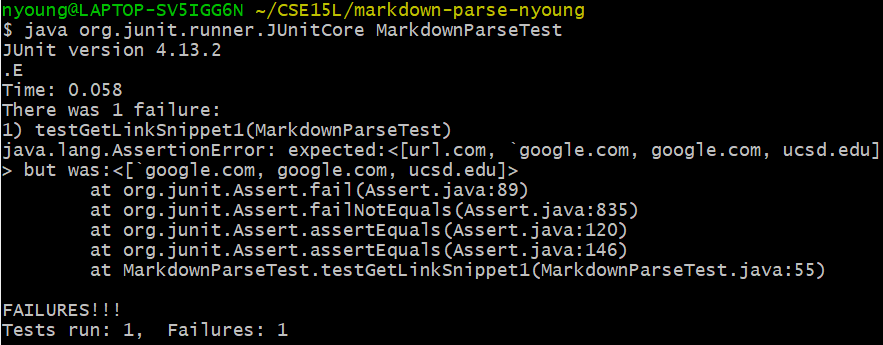
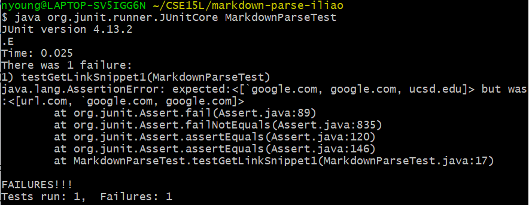
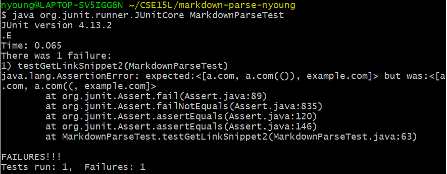
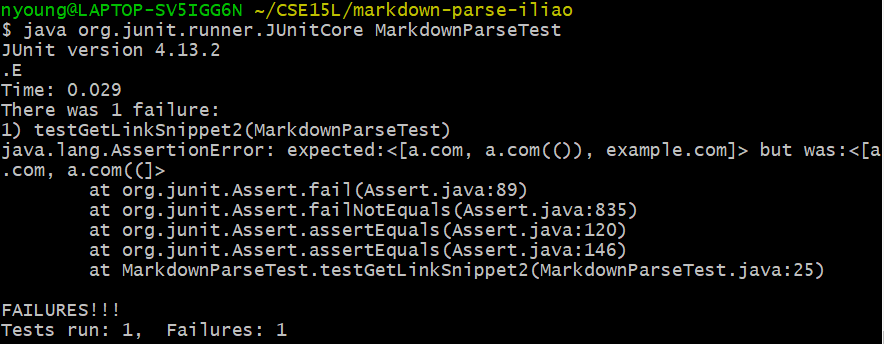
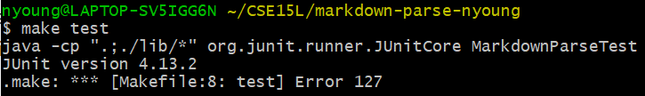
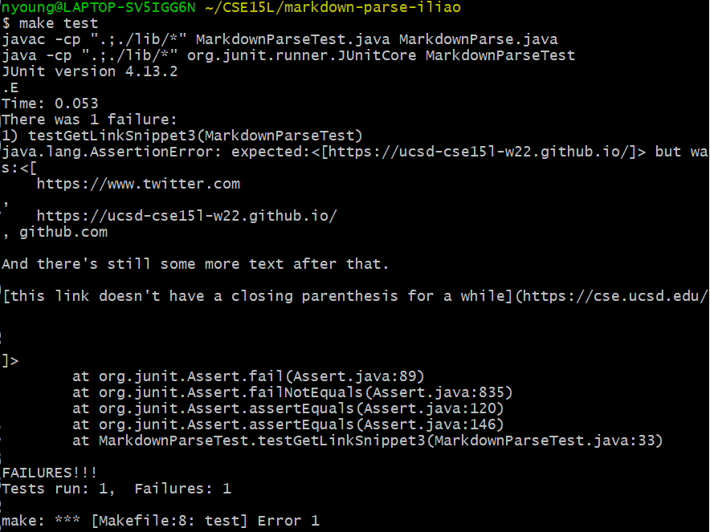

# Lab Report 4 Week 8 - Testing Implementations

First published: 2022-02-24  
Last modified: 2022-02-28

[Lab 7: Code Review](https://ucsd-cse15l-w22.github.io/week/week7/)

[Lab 8: Debuggers](https://ucsd-cse15l-w22.github.io/week/week8/)

[Report Guidelines](https://ucsd-cse15l-w22.github.io/week/week8/#week-8-lab-report)

Links:
- [My markdown-parse repo](https://github.com/natalieycyoung/markdown-parse)
- [Another group's markdown-parse repo](https://github.com/iireneliao/markdown-parse)

## Snippet 1
	`[a link`](url.com)
	
	[another link](`google.com)`
	
	[`cod[e`](google.com)
	
	[`code]`](ucsd.edu)

### My Implementation

The test in my `MarkdownParseTest.java`:  

The results of the test:  

### Another Implementation

The test in the other group's `MarkdownParseTest.java`:  

The results of the test:

## Snippet 2
	[a [nested link](a.com)](b.com)
	
	[a nested parenthesized url](a.com(()))
	
	[some escaped \[ brackets \]](example.com)

### My Implementation

The test in my `MarkdownParseTest.java`:  

The results of the test:  

### Another Implementation

The test in the other group's `MarkdownParseTest.java`:  

The results of the test:

## Snippet 3
	[this title text is really long and takes up more than 
	one line
	
	and has some line breaks](
	    https://www.twitter.com
	)
	
	[this title text is really long and takes up more than 
	one line](
	    https://ucsd-cse15l-w22.github.io/
	)
	
	
	[this link doesn't have a closing parenthesis](github.com
	
	And there's still some more text after that.
	
	[this link doesn't have a closing parenthesis for a while](https://cse.ucsd.edu/
	
	
	
	)
	
	And then there's more text

### My Implementation

The test in my `MarkdownParseTest.java`:  

The results of the test:  

### Another Implementation

The test in the other group's `MarkdownParseTest.java`:  

The results of the test:

