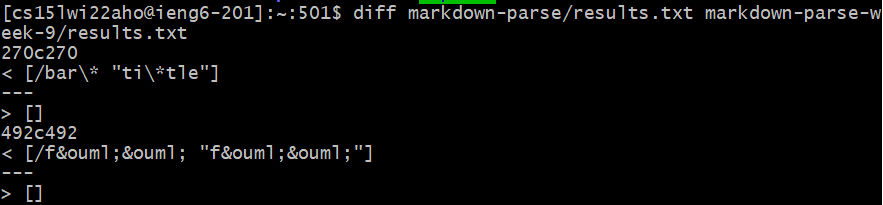
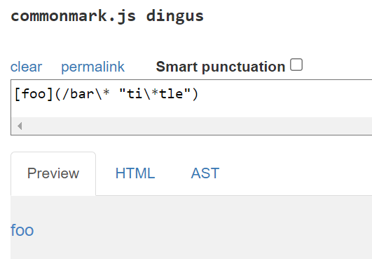
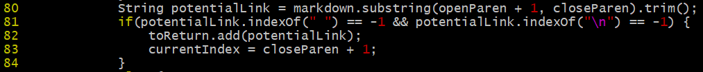
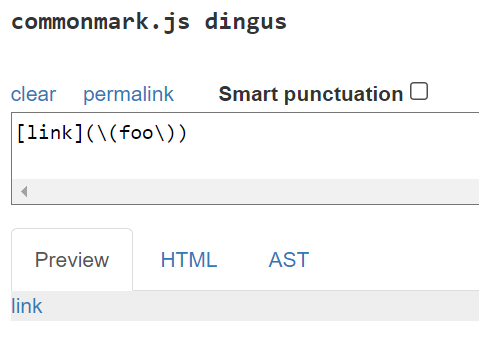
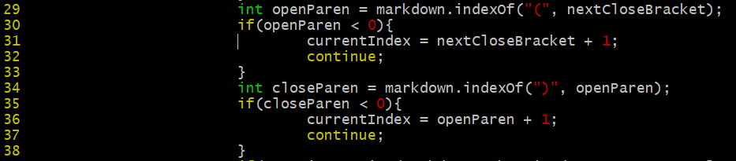

# Lab Report 5 Week 10 - `diff`

First published: 2022-03-11  
Last modified: 2022-03-11

[Lab 9: Bash Scripts](https://ucsd-cse15l-w22.github.io/week/week9/)

[Lab 10: CommonMark Parser](https://ucsd-cse15l-w22.github.io/week/week10/)

[Report Guidelines](https://ucsd-cse15l-w22.github.io/week/week10/#lab-report-5)

Links:
- [My markdown-parse repo](https://github.com/natalieycyoung/markdown-parse)
- [The CSE15L markdown-parse repo](https://github.com/ucsd-cse15l-w22/markdown-parse)

In this lab report, I will discuss the results of two tests from commonmark-spec on my implementation and the course implementation of `markdown-parse`. For both implementations, I used a bash script to loop through the directory containing the test files and run the respective implementation of `MarkdownParse.java` with each file. After outputting the results to textfiles named `results.txt` in their respective folders and using `diff`, I found that the two tests had different results.

## Test 1

The test:  

Line indicating which `.md` file:  

Contents of `.md` file:  

	[foo](/bar\* "ti\*tle")

### Discussion

The contents of `22.md` correctly rendered as a link using [commonMark demo tool](https://spec.commonmark.org/dingus/):  

In this case, the expected output is

	/bar\* "ti\*tle"

I think my implementation of `MarkdownParse.java` was correct since it matches the text within the parentheses in the contents of `22.md`.

The course implementation, on the other hand, did not give any output. This can be attributed to an issue in lines 80 to 84 of the course implementation of `MarkdownParse.java`:  

This implementation does not account for links that include spaces while my implementation does. On line 80, the `String` `potentialLink` is set to the substring found between an open and close parentheses. While the `trim()` method accounts for spaces on either end of the substring, it does not account for spaces within the substring. The line causing the issue is line 81, which has an `if`-statement with the condition that the substring must not have any whitespaces or newline characters to be returned as a link. (The fix to this would be to remove the condition so that any substrings found between parentheses would be added to the list of links to be returned.)

## Test 2

The test:  

Line indicating which `.md` file:  

Contents of `.md` file:  

	[link](\(foo\))	

### Discussion

The contents of `494.md` correctly rendered as a link using [commonMark demo tool](https://spec.commonmark.org/dingus/):  

Since the link renders correctly, the expected output is:  

	\(foo\)

In this case, the output from my implementation is incorrect since it is missing a close parenthesis `)` while the output from the course implementation is correct. Lines 29-38 of my implementation of `MarkdownParse.java` are responsible for the bug:

Line 34 deals with close parentheses, but once the program comes across the first-occurring close parenthesis, its index is taken so the substring between the first open parenthesis and it (the first-occurring close parenthesis) can later be returned as a possible link. This leaves out later-occurring parentheses. To fix this bug, the code could be modified to set the index of `closeParen` to that of the last occurrence of `)`.
