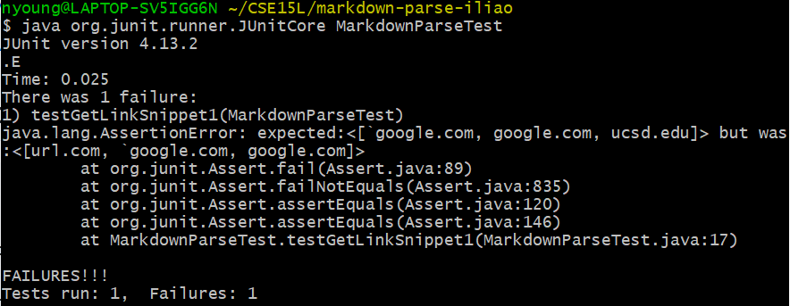

# Lab Report 5 Week 10 - `diff`

First published: 2022-03-11  
Last modified: 2022-03-11

[Lab 9: Bash Scripts](https://ucsd-cse15l-w22.github.io/week/week9/)

[Lab 10: CommonMark Parser](https://ucsd-cse15l-w22.github.io/week/week10/)

[Report Guidelines](https://ucsd-cse15l-w22.github.io/week/week10/#lab-report-5)

Links:
- [My markdown-parse repo](https://github.com/natalieycyoung/markdown-parse)
- [The CSE15L markdown-parse repo](https://github.com/ucsd-cse15l-w22/markdown-parse)

In this lab report, I will discuss the results of two tests from commonmark-spec on my implementation and the course implementation of `markdown-parse`. I used a bash script to loop through the directory containing the test files and run my implementation of `MarkdownParse.java` with each file. After outputting the results to text files and using `diff`, I found that the two tests had different results.

## Test 1

The test:  

The `.md` file:  

	[foo](/bar\* "ti\*tle")

### My Implementation

My implementation failed the test on Snippet 1 since the expected output did not match the actual output; `url.com` was included in the list when it shouldn't have been.  

Expected output:  

	[`google.com, google.com, ucsd.edu]  

Actual output:  

	[url.com, `google.com, google.com, ucsd.edu]

### Course Implementation

The other group's implementation also failed the test on Snippet 1 as the expected output and actual output did not match; `url.com` was included in the list when it shouldn't have been and `ucsd.edu` was left out.  

Expected output:  

	[`google.com, google.com, ucsd.edu]

Actual output:  

	[url.com, `google.com, google.com]

### Discussion

I think 

## Test 2

The test:  

The `.md` file:  

	[link](\(foo\))	

### My Implementation

My implementation failed the test on Snippet 2 as the expected and actual outputs did not match; two close parentheses `))` were missing.

Expected output:  

	[a.com, a.com(()), example.com]  

Actual output:  

	[a.com, a.com((, example.com]

### Course Implementation

The other group's implementation also failed the test on Snippet 2 as the expected and actual outputs did not match; two close parentheses `))` and `example.com` were missing from the list.

Expected output:  

	[a.com, a.com(()), example.com]  

Actual output:  

	[a.com, a.com((]

