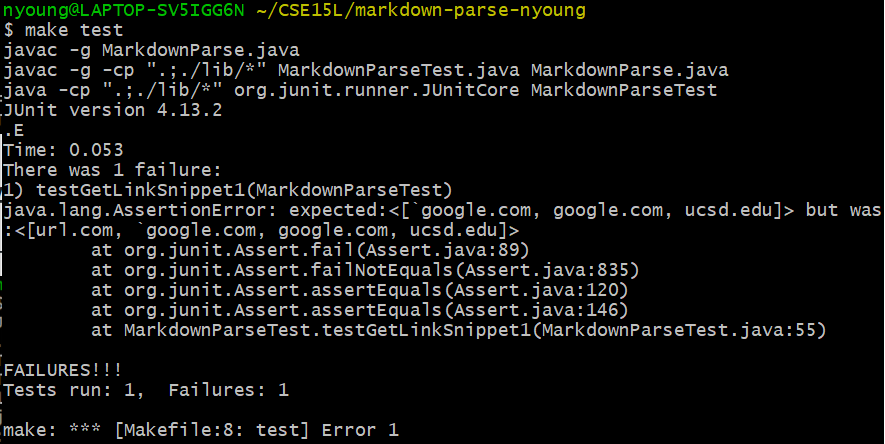
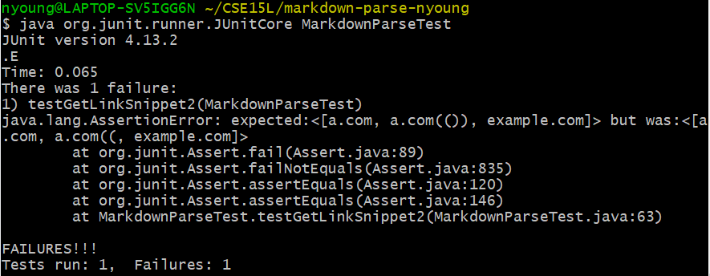
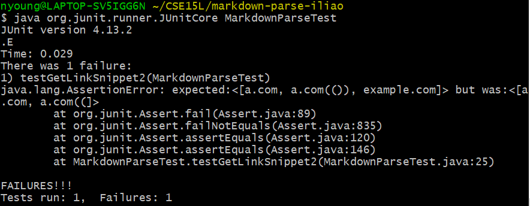
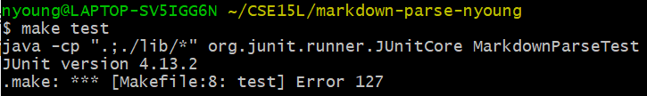
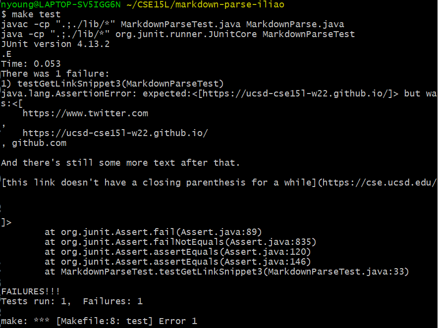

# Lab Report 5 Week 10 - `diff`

First published: 2022-03-11  
Last modified: 2022-03-11

[Lab 9: Bash Scripts](https://ucsd-cse15l-w22.github.io/week/week9/)

[Lab 10: CommonMark Parser](https://ucsd-cse15l-w22.github.io/week/week10/)

[Report Guidelines](https://ucsd-cse15l-w22.github.io/week/week10/#week-10-lab-report)

Links:
- [My markdown-parse repo](https://github.com/natalieycyoung/markdown-parse)
- [The CSE15L markdown-parse repo](https://github.com/ucsd-cse15l-w22/markdown-parse)

In this lab report, I will discuss the results of two tests from commonmark-spec on my implementation and the course implementation of `markdown-parse`.

## Test 1

The test:  

### My Implementation

My implementation failed the test on Snippet 1 since the expected output did not match the actual output; `url.com` was included in the list when it shouldn't have been.  

Expected output:  

	[`google.com, google.com, ucsd.edu]  

Actual output:  

	[url.com, `google.com, google.com, ucsd.edu]

### Course Implementation

The other group's implementation also failed the test on Snippet 1 as the expected output and actual output did not match; `url.com` was included in the list when it shouldn't have been and `ucsd.edu` was left out.  

Expected output:  

	[`google.com, google.com, ucsd.edu]

Actual output:  

	[url.com, `google.com, google.com]

### Discussion  
I think there is a less-than-ten-line code change that could make my program work for Snippet 1 and all related cases that use inline code with backticks. My implementation currently takes the backticks within brackets into account, but an `if`-statement could be used to ignore backticks between open and close square brackets until the next set of parentheses are found.

## Test 2
	[a [nested link](a.com)](b.com)
	
	[a nested parenthesized url](a.com(()))
	
	[some escaped \[ brackets \]](example.com)

The test in `MarkdownParseTest.java`:  

### My Implementation

My implementation failed the test on Snippet 2 as the expected and actual outputs did not match; two close parentheses `))` were missing.

Expected output:  

	[a.com, a.com(()), example.com]  

Actual output:  

	[a.com, a.com((, example.com]

### Course Implementation

The other group's implementation also failed the test on Snippet 2 as the expected and actual outputs did not match; two close parentheses `))` and `example.com` were missing from the list.

Expected output:  

	[a.com, a.com(()), example.com]  

Actual output:  

	[a.com, a.com((]

### Discussion
I think there is a less-than-ten-line code change that could make my program work for Snippet 2 and all related cases of nested parentheses, square brackets, and escaped square brackets. Conditional statements can be edited or added so that (inner) nested open and close square brackets and (inner) nested open and close parentheses are ignored. A temporary variable can be used to store the indices of the most recently found close square brackets and parentheses and can be updated until the last ones in the file are found. In the case that there aren't any close square brackets or parentheses, no links will be included in the list.

## Snippet 3
	[this title text is really long and takes up more than 
	one line
	
	and has some line breaks](
	    https://www.twitter.com
	)
	
	[this title text is really long and takes up more than 
	one line](
	    https://ucsd-cse15l-w22.github.io/
	)
	
	
	[this link doesn't have a closing parenthesis](github.com
	
	And there's still some more text after that.
	
	[this link doesn't have a closing parenthesis for a while](https://cse.ucsd.edu/
	
	
	
	)
	
	And then there's more text

The test in `MarkdownParseTest.java`:  

### My Implementation

  

The test for Snippet 3 on my implementation could not be completed as it got stuck in an infinite loop; I had to use `CTRL-C` to end the process.

### Another Implementation

  

The other group's implementation failed the test for Snippet 3 since the expected and actual outputs did not match; the issue seems to be related to newline `\n` characters.

Expected output:  

	[https://ucsd-cse15l-w22.github.io/]  

Actual output:  

	[  
		https://www.twitter.com  
	,  
		https://ucsd-cse15lw22.github.io/  
	, github.com  

	And there's still some more text after that.

	[this link doesn't have a closing parenthesis for a while](https://cse.ucsd.edu/

	]

### Discussion
I think there is a less-than-ten-line code change that could make my program work for Snippet 3 and all related cases that have newline characters in brackets and parentheses. I can add loops to iterate through the file contents and specifically look for open square brackets and parentheses. If they are found, then the traversal can continue and `StringBuffers` and `\n` can be used to check if there is a new line. If a newline `\n` is detected, a conditional statement can be used to continue the traversal beginning from the newline.
